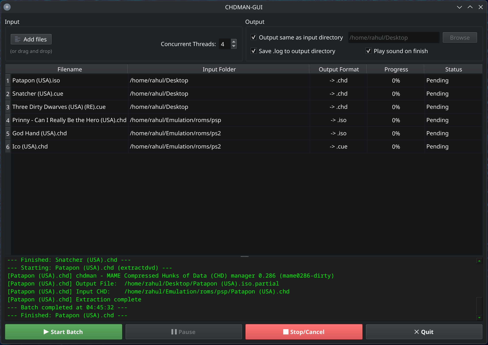

# CHDMAN-GUI

A cross-platform, multi-threaded GUI wrapper for MAME's `chdman` tool. 

Batch-convert your CD and DVD dumps (`.cue`, `.iso`, `.gdi`, `.toc`) to the compressed `.chd` format, or extract them back to their original formats with a single click.

Vibe coded with Gemini.


## Features
* **Smart Auto-Detection:** Just drop your files in. The app automatically knows whether to run `createcd`, `createdvd`, `extractcd`, or `extractdvd` based on the file extension and CHD headers.
* **Multi-threaded Batching:** Queue up dozens of games. Convert multiple files simultaneously using custom thread limits.
* **Safe Halts & System Sleep Prevention:** Built-in safeguards prevent your PC from going to sleep during long batch conversions. Supports OS-level Pausing (Linux/macOS) and safe `.partial` file cleanup if cancelled.

## Screenshot



## Installation & Requirements

**Important:** This application is a *wrapper*. It **requires** the `chdman` executable to be present on your system to function.

### Step 1: Install `chdman`
* **Windows:** Download the official [MAME release](https://www.mamedev.org/release.html). Extract it, find `chdman.exe`, and place it in the exact same folder as `CHDMAN-GUI.exe`. (Alternatively, add it to your system PATH).
* **Linux:** Install the MAME tools package via your package manager.
  * *Fedora:* `sudo dnf install -y mame-tools`
  * *Ubuntu/Debian:* `sudo apt install mame-tools`
  * *Arch:* `sudo pacman -S mame-tools`
* **macOS:** Install via Homebrew: `brew install rom-tools`

### Step 2: Download CHDMAN-GUI
Go to the **[Releases](../../releases/latest)** page and download the compiled binary for your operating system:
* `CHDMAN-GUI-Windows-x86_64.exe` (Windows)
* `CHDMAN-GUI-Linux-x86_64` (Linux standalone binary)
* `CHDMAN-GUI-macOS-AppleSilicon.zip` (M1/M2/M3 Macs)
* `CHDMAN-GUI-macOS-Intel.zip` (Older Intel Macs)

No installation required, just extract and run.

## Usage

1. Open CHDMAN-GUI.
2. Drag and drop your `.iso`, `.cue`, `.gdi`, or `.chd` files into the window.
3. Select an output directory (or leave the default "Same as input").
4. Adjust "Concurrent Threads" (Warning: High thread counts on spinning HDDs may cause slower conversions due to disk thrashing. Keep to 1 or 2 for HDDs).
5. Click **Start Batch**.

## Building from Source
If you prefer to run the Python script directly or build the binaries yourself:

```bash
# Clone the repo
git clone [https://github.com/YOUR_USERNAME/CHDMAN-GUI.git](https://github.com/YOUR_USERNAME/CHDMAN-GUI.git)
cd CHDMAN-GUI

# Install dependencies
pip install PyQt6

# Run directly
python chman_gui.py

# Or build a standalone executable
pip install pyinstaller
pyinstaller --noconsole --onefile --name CHDMAN-GUI chman_gui.py
